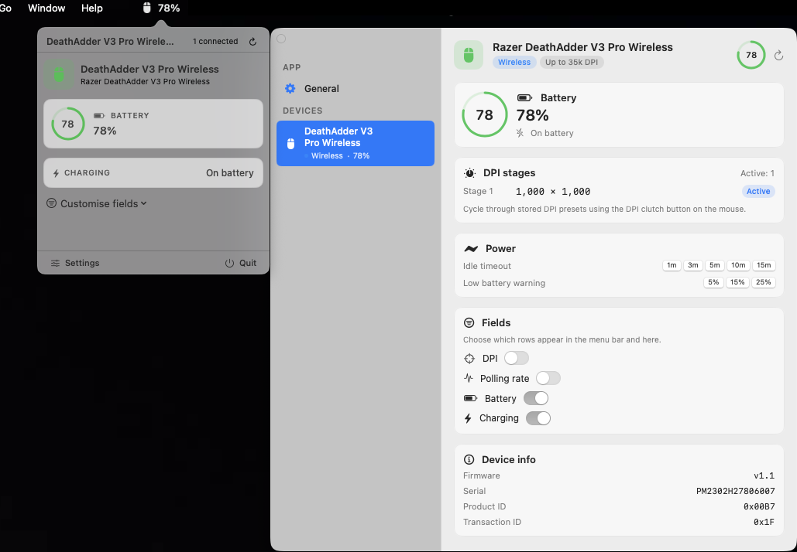

# Tiny Razer

A tiny, native macOS menu bar app to control Razer peripherals.
No Synapse, no daemon, no kernel extension.



<p align="center">
  <a href="https://github.com/B-HS/tiny-razer/releases/latest">Download the latest release →</a>
</p>

## What it does

- Reads and writes **DPI**, **polling rate**, **battery level**, and **charging state** straight over IOKit HID.
- Surfaces live values in the menu bar status item — pick which metrics you want shown per device.
- Settings window with slider, preset buttons, custom X/Y DPI (link or split), polling-rate picker.
- Automatic dedupe when a device is connected over both the dongle and a USB cable.
- Catalog covers **255 Razer devices** (mouse / keyboard / headset / mousepad / accessory); transaction ID, wireless flag and hyper-polling support are all derived from openrazer upstream.

## Install

```bash
git clone https://github.com/B-HS/tiny-razer
cd tiny-razer
./build-app.sh release
open ".build/Tiny Razer.app"
```

Requires macOS 14 (Sonoma) or later.

### Grant Input Monitoring

macOS blocks HID control of third-party peripherals until it's allowed in
**System Settings → Privacy & Security → Input Monitoring**. On first launch
Tiny Razer shows the instructions inline — click *Open Settings*, toggle it
on, then fully quit and relaunch the app from the menu bar. You only need to
do this once.

## Usage

1. The app lives in the menu bar — click the mouse icon to open the panel.
2. Toggle individual fields under **Customise fields** to choose what shows up in the status item and in the panel.
3. Click **Settings** for per-device DPI, polling rate, battery and more.

## Supported devices

The device catalog is generated from the [openrazer](https://github.com/openrazer/openrazer) upstream and covers the full Razer lineup — 113 mice, 110 keyboards, 8 headsets, 8 mouse mats, 16 accessories. Older devices (pre-2015) that use legacy protocols may need manual verification.

To refresh the catalog against the latest openrazer:

```bash
bun run scripts/gen-catalog.ts
```

## Development

```bash
swift build      # build the SPM package
swift test       # 31 unit tests covering the wire protocol + catalog
./build-app.sh release   # produce a signed .app bundle
```

`build-app.sh` auto-selects a codesigning identity in this order:

1. `$CODESIGN_IDENTITY` env var — use your Developer ID for distribution.
2. First `Apple Development: …` found in the keychain — stable across rebuilds, preserves TCC grants.
3. `-` (ad-hoc) — permissions will need to be re-granted after every rebuild.

For local development with a persistent Input Monitoring grant, run
`scripts/setup-dev-identity.sh` once — it provisions a self-signed code
signing cert so your TCC approval survives incremental builds.

## Project layout

```
Sources/
  RazerKit/                  Pure-Swift library, zero UI dependency
    Protocol/                90-byte HID report, CRC, transaction/command IDs
    Commands/                Razer command builders (ported from openrazer)
    Transport/               IOKit HIDManager actor wrapper
    Device/                  RazerDevice — feature methods per handle
    Features/                Capability enum
    Catalog/
      Generated/             Auto-emitted per category (mouse/keyboard/…)
  TinyRazer/                 SwiftUI menu bar + settings window
    App/ Menu/ Settings/ Core/ UI/
Tests/
  RazerKitTests/             Report layout, CRC vectors, catalog checks
scripts/
  gen-catalog.ts             openrazer → Swift descriptor generator (Bun)
  setup-dev-identity.sh      One-time self-signed code sign identity
  reset-permissions.sh       tccutil reset helper
```

## Roadmap / not yet supported

openrazer exposes a much larger feature surface than what's plumbed through today. The items below are on the roadmap but not implemented yet — contributions welcome.

**Harder features**
- Per-key RGB for keyboards (`MATRIX_DIMS` layout + custom-frame framebuffer transfer)
- Ripple effect (real-time matrix animation in response to keypresses)
- Hardware macros (record / store / replay on-device macros)
- Onboard profile storage (save / load / switch profiles stored on the device)
- Game-mode toggle (disable Win key, Alt+Tab, etc.)
- Scroll acceleration / Basilisk smart-reel

**Device-specific niche protocols**
- ARGB channel control for Chroma accessories (strip / fan / headset stands)
- Kraken headset EEPROM-based RGB programming (distinct wire protocol from mice/keyboards)
- Basilisk HyperScroll wheel haptic-resistance steps
- Naga side-button hardware remapping
- DeathStalker per-row backlight
- Tartarus keypad layout swapping
- Per-zone effects on multi-zone mice (logo / scroll / left / right separately — today Tiny Razer drives only the matrix zone)

## Credits

Protocol reverse-engineering, device IDs and per-device quirks originate from the [openrazer](https://github.com/openrazer/openrazer) Linux driver project. Tiny Razer ports the platform-independent portion of that work to Swift.

## License

GPL-2.0 · Hyunseok Byun
