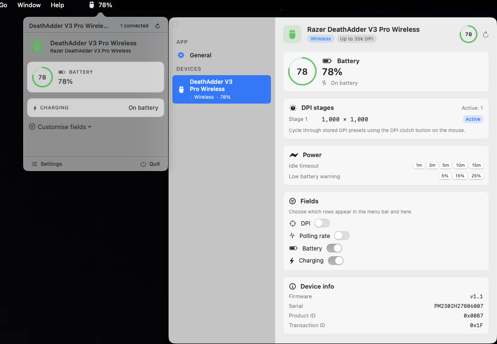

# Tiny Razer

A tiny, native macOS menu bar app to control Razer peripherals.
No Synapse, no daemon, no kernel extension.



<p align="center">
  <a href="https://github.com/B-HS/tiny-razer/releases/latest">Download</a>
</p>

## What it does

- Reads and writes **DPI**, **polling rate**, **battery** and **charging** straight over IOKit HID.
- Live values in the menu bar — pick which metrics to show per device.
- Settings window: DPI slider / presets, custom X/Y, polling-rate picker, lighting.
- Covers **255 Razer devices**, all derived from [openrazer](https://github.com/openrazer/openrazer) upstream.

## Install

Requires macOS 14 (Sonoma) or later.

```bash
git clone https://github.com/B-HS/tiny-razer
cd tiny-razer
./build-app.sh release
open ".build/Tiny Razer.app"
```

On first launch, allow the app under **System Settings → Privacy & Security → Input Monitoring**, then quit and relaunch — macOS blocks HID control of third-party peripherals until you do. You only need to do this once.

## Develop

```bash
swift build
swift test
bun run scripts/gen-catalog.ts   # regenerate the device catalog from openrazer
```

## Credits

Protocol, device IDs and per-device quirks come from the [openrazer](https://github.com/openrazer/openrazer) Linux driver project; Tiny Razer ports the platform-independent part to Swift.

## License

GPL-2.0 · Hyunseok Byun
